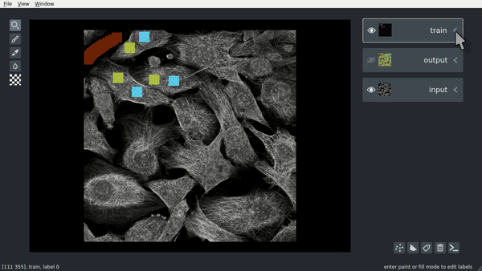
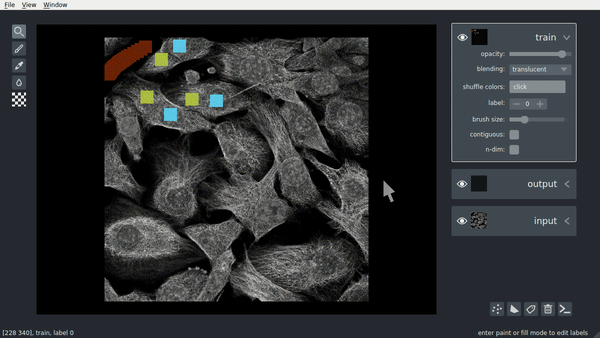
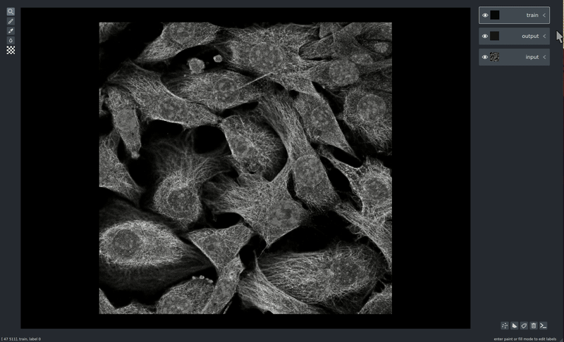
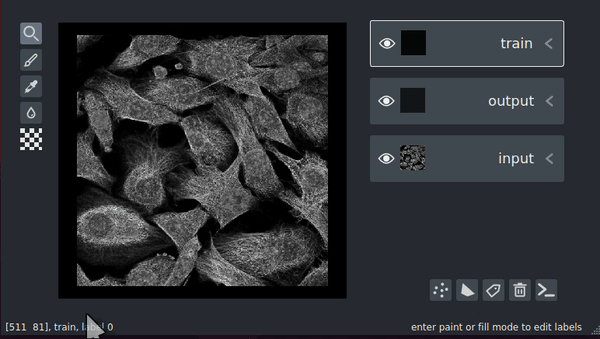
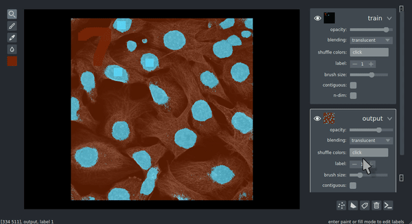
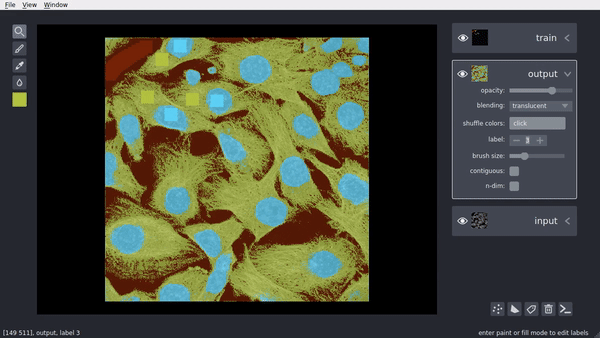

# Segmentify

Segmentify is an interactive and general purpose cell segmentation plugin for the multi-dimentional image viewer [Napari](https://github.com/napari/napari).

 <p align=center"></p>

In the example above, the user is using segmentify to segment out the nucleus, cytoplasm and the background for all the cells in the image. The user uses the paint brush tool to label some training examples on the **train layer**. The entire image is featurized using a pretrained featurizer, and the selected examples are used to train a Random Forest Classifier. Lastly, the trained classifier is used to predict the label for all the remaining unlabeled pixels, and the segmentation output is displayed at the **output layer**.

## Installation

Segmentify can be installed using **pip**

```
pip install segmentify
```

## Launching Segmentify Viewer

Segmentify's viewer can be launched either using the command line interface or a python script.


### Segmentify Command Line Interface

The Segmentify Viewer can be launched from the command line by entering:

```
segmentify <path to your images>
```

### Segmentify Script

To open Segmentify's Viewer from a python script, enter the following scripts:

```python
from segmentify import Viewer, gui_qt, util

img = util.parse_img(<path to your image>)

with gui_qt():
    viewer = Viewer(img)
```

An example can be found [here](./examples/viewer_example.py)

## Featurization

Segmentify works by featurizing input images using either pretrained UNet models or some classical image filters. Users can then use the paint brush to label some of the pixels to train a Random Forest Classifier. The trained classifier is used to predict the label for all remaining unlabeled pixels. The training labels should be provided in the **train layer** and the segmentation will be displayed on the **output layer**. Segmentify includes the following featurization strategies:
- HPA\_4: Trained by decomposing images from the [Human Protein Atlas](https://www.kaggle.com/c/human-protein-atlas-image-classification) into Nucleus, ER, Protein and Cytoplasm
- HPA\_3: Trained by decomposing images from the [Human Protein Atlas](https://www.kaggle.com/c/human-protein-atlas-image-classification) into Nucleus, ER, Cytoplasm
- HPA: Trained by segmenting out the nucleus in images from the [Human Protein Atlas](https://www.kaggle.com/c/human-protein-atlas-image-classification)

- Nuclei: Trained by segmenting out the nucleus in images from the [Kaggle Data Science Bowl 2018](https://www.kaggle.com/c/data-science-bowl-2018/overview)
- Filter: Combining several classical image filter (Gaussian, Sobel, Laplace, Gabor, Canny)

For more information about the training strategies for each featurizer, please refer to the notebooks [here](https://github.com/marshuang80/CellSegmentation/tree/master/notebooks)

### Training your own featurizer

Users can also train their own image featurizers using [Cell Segmentation](https://github.com/marshuang80/CellSegmentation). The trained model should be placed in the *./segmentify/model/saved_model* directory.

## Key Bindings

The following is a list of Segmentify supported functions along with their key bindings:
- Segmentation (Shift-S)
- Uncertainty Heatmap (Shift-H)
- Next Featurizer (Shif-N)
- Dilation (Shift-D)
- Erosion (Shift-E)
- Close (Shift-C)
- Open (Shift-O)
- Fill holes (Shift-F)
- Next featurizer (Shift-N)

> For all image morphology steps (dilation, erosion, close, open, fill holes), **the operations will only be applied to the selected label for the selected layer**. For example, if you want the blue labels in the segmented images to dilate, you will have to click on the *output layer* and increment to the desired label.

| Morphology on labels | Morphology on segmentation |
| --- | --- |
|  |  |


### Segmentation (Shift-S)

Some labeled training examples must be provided before segmentify can segment the input images. The training labels can be provided by using the paint brush on the left-hand side of the Viewer to paint on the image. Please make that you are incrementing the labels in the **train** layer.



The segmented output can be found on the **output** layer.

### Uncertainty Heatmap (Shift-H)

The Segmentify Viewer can also output a heatmap of areas where the model is having low confidence in it's segmentation. Users can relabel these areas to help improve the model's prediction. The uncertainty heatmap is generated by calculating the normalized entropy for the prediction probabilities. Similar prediction probability for all classes indicates that the model does not have confidence in one particular class, which results in low entropy; whereas high probability for one particular class results in high entropy. Using normalized entropy allow us to generate the uncertainty heatmap even when there are many segmentation classes. The lower the entropy for a pixel (high uncertainty), the brighter it will appear in red on the heatmap.

To show the uncertainty heatmap, set the heatmap parameter to true when defining the Viewer:

```python
Viewer(imgs, heatmap=True)
```

If you are using the Command Line Interface, set the heatmap flag to True:

```
segmentify <path to your image> --heatmap True
```


### Next Featurizer (Shift-N)

This feature cycles through all the featurizers in *segmentify/model/saved_model* as well as the filter featurizer. The name of the selected featurizer is shonw in the bottom left corner of the viewer. Note that after switching to the next featurizer, the user still needs to press Shift-S to re-segment the image.



### Dilation (Shift-D)

The [dilation operation](https://homepages.inf.ed.ac.uk/rbf/HIPR2/dilate.htm) expands all connected components with the selected label.



### Erosion (Shift-E)

The [erosion operation](https://homepages.inf.ed.ac.uk/rbf/HIPR2/erode.htm) shrinks all connected components with the selected label.


### Fill Holes (Shift-F)

This operation fills holes within a connected component for the selected label.



### Close (Shift-C)

The [close operation](https://homepages.inf.ed.ac.uk/rbf/HIPR2/close.htm)is done by applying dilation on the connected components with the selected label, following by an erosion.

### Open (Shift-O)

The [open operation](https://homepages.inf.ed.ac.uk/rbf/HIPR2/open.htm) is done by applying erosion on the connected components with the selected label, following by an dilation.

